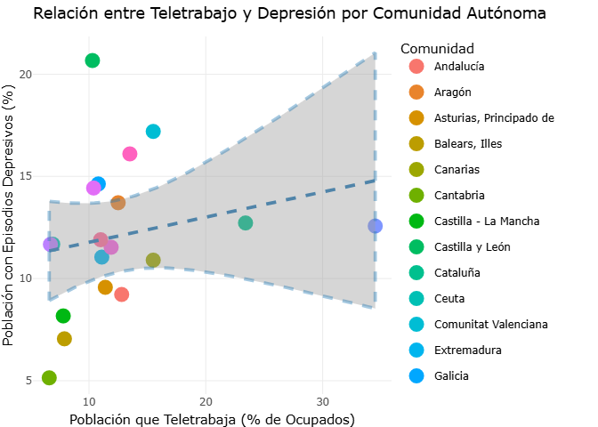
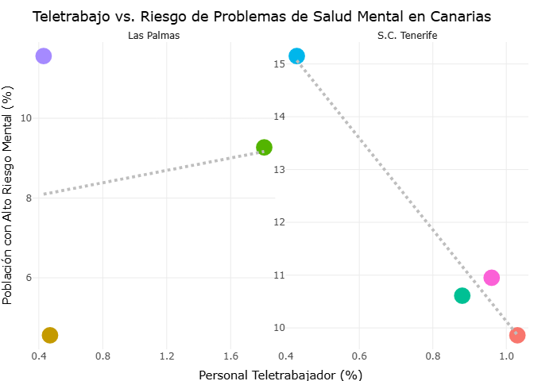

# seminario-teletrabajo-saludmental
Seminario para la asignatura "Fuentes de Datos Biomédicas y Web Semántica" (UBU) sobre la relación entre teletrabajo y salud mental.

# Introducción

La relación entre la salud mental y el empleo, especialmente en los trabajos que implican muchas horas frente a un ordenador, ha cobrado una importancia creciente en los últimos años debido al aumento de episodios depresivos y estrés laboral entre la población trabajadora. 
Diversos estudios señalan que el teletrabajo puede ofrecer ventajas como la mejora de la conciliación o la reducción de desplazamientos, pero también puede favorecer el aislamiento, la dificultad para desconectar y la sensación de sobrecarga emocional.

En este seminario analizamos hasta qué punto el teletrabajo se asocia con la salud mental en España, centrándonos en los episodios depresivos y en el riesgo de mala salud mental. 

Para ello, combinamos datos estatales de prevalencia de depresión por comunidades autónomas con indicadores de teletrabajo tanto a nivel autonómico como provincial, y realizamos un análisis específico del caso de las Islas Canarias, donde disponemos de información detallada por isla. A través de esta integración de bases de datos públicos y visualizaciones interactivas, exploramos si las regiones con mayor implantación del teletrabajo presentan también peores indicadores de salud mental, identificamos excepciones a esta tendencia y estudiamos cómo el contexto económico y territorial puede modificar la relación entre trabajo remoto y bienestar psicológico.

#  Objetivos

## Objetivo General
**Demostrar si es que existe, la relación entre episodios depresivos y el teletrabajo, en la actualidad. **

## Objetivos Específicos

**1.** Comparar los valores del teletrabajo y la depresión en las distintas comunidades autónomas para el tipo de tendencia que siguien.

**2.** Análisis de las excepciones a la tendencia.

**3.** ¿Qué pasa en un lugar específico? Analizar en detalle el caso de las Islas Canarias para evaluar si la población que teletrabaja presenta un mayor riesgo de problemas de salud mental.

# Resultados 
## Relacion entre teletrabajo y salud mental en España por comunidades

   

## Relacion entre teletrabajo y salud mental en las Islas Canarias 

   

# Conclusiones 

### Conclusiones de los objetivos específicos

**1. Comparar los numeros del teletrabajo y la depresión en las distintas comunidades autónomas para ver que tipo de tendencia siguen.¨**

Hemos observado una clara tendencia ascendente confirmando que las comunidades autónomas con mayor porcentaje de teletrabajadores como por ejemplo Madrid o Cataluña son tambien las que tienen el mayor porcentaje de poblacion con depresión, en cambio las comunidades con menos implantación de teletrabajo (Castilla La Mancha, Cantabria) se situan consistentemente en los niveles mas bajos de depresión.
Destacamos que hay comunidades que se salen de lo establecido como Castilla y León que con un bajo porcentaje de pobalción teletrabajadora muestra el mayor nivel de población con niveles depresivos. 

**2. Analisis de las excepciones a la tendencia.**

Aun que la tendencia nacional es que "a mas teletrabajo mas depresión" comunidades como Castilla y León o Galicia rompen esta regla, se situan en la zona de bajo teletrabajo pero altos niveles de depresión. Esto desmuesta que el teletrabajo no es el único culpable en estas comunidades si no que factores demográficos como el envejecimiento de la población y la dispersión rural tienen un peso mucho mayor en la salud mental que la modalidad de teletrabajo que estamos analizando. 

Mientras que en Madrid el estrés puede venir de la hiperconexión y el teletrabajo en Castilla y León el riesgo para la salud mental proviene de otros factores, lo que genera cifras altas de depresión sin necesidad de teletrabajo. 

**3. ¿Qué pasa en un lugar específico? Estudiamos de cerca las islas canarias para ver si la gente que teletrabaja tiene mas riesgo mental. **

Al contrario de lo que ocurre a nivel nacional, en las Islas Canarias los datos muestran una tendencia inversa, podemos destacar el caso de la isla de Lanzarote, esta isla presenta una baja tasa de teletrabajo y un alto índice en el riesgo de salud mental.

En contraste a esto, encontramos a Gran Canaria y El Hierro que lideran el teletrabajo en las islas, pero presentan niveles de riesgo mental signitivamente más bajos. 

Esto puede corresponderse a que las islas con menos teletrabajo como hemos dicho Lanzarote dependen casi exclusivamente de sectores presenciales (el turismo intensivo). Lo que las hace más vulnerables a inestabilidades económicas y laborables, disparando los índices de depresión. 

Los datos de El Hierro y Gran Canaria nos revelan el matiz crucial en el archipiélago, el teletrabajo parece actuar como un factor protector asociado a la inestabilidad laboral. En estas islas tener un trabajo que permita teletrabajar es un privilegio que portege tu salud mental frente a la incertidumbre económica que nos puede provocar el turismo.

## Conclusión General

El objetivo general era ver si existe una conexión entre el teletrabajo y la salud mental en la población española.

Los resultados demuestran una correlación positiva entre la penetración del teletrabajo entre las comunidades autónomas y la prevalencia de episodios depresivos. Esta relación sugiere que los entornos con una estructura laboral que facilita el teletrabajo (típicamente grandes ciudades) son también aquellos donde la población reporta grandes problemas de salud mental. 

Sin embargo esta correlación no implica causalidad, ambas variables pueden ser impulsadas por un tercer factor, el tipo de actividad económica, envejecimiento de la población o dispersión rural. 

El teletrabajo no es la causa directa de la depresión por si mismo, más bien actúa como un indicador de la estructura económica de cada región. En la Península señala zonas saturadas y estresadas, mientras que en territorios insulares y fragmentados, su presencia es sinónimo de calidad y seguridad laboral protegiendo la salud mental de teletrabajos. 

# Bibliografía

Tomasina, F., & Pisani, A. (2022). Pros y contras del teletrabajo en la salud física y mental de la población general trabajadora: una revisión narrativa exploratoria. Archivos de Prevención de Riesgos Laborales, 25(2), 147-161. https://doi.org/10.12961/aprl.2022.25.02.07

Inicio ISTAC - Gobierno de Canarias. (s. f.). https://www.gobiernodecanarias.org/istac/

INE - Instituto Nacional de Estadística. (s. f.). INE. Instituto Nacional de Estadística. INE. https://www.ine.es/

Datos abiertos del Gobierno de España | datos.gob.es. (s. f.). Datos Abiertos del Gobierno de España | datos.gob.es. https://datos.gob.es/es/